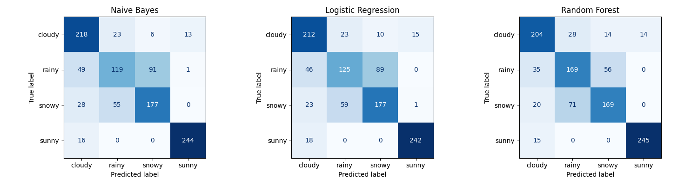

# Weather-Conditioned Music Classification Engine

Predict a suitable weather category given a song's audio features.

Demo video: https://drive.google.com/file/d/1nc7trHjiscxEsSmc9bRy0GR-1T8RSImB/view?usp=sharing

## Two Demo Paths

### Demo 1: Run the Website Locally

This starts the FastAPI backend + the Vite frontend.

1. Backend setup:

```bash
python -m venv venv
source venv/bin/activate
pip install -r requirements.txt
```

2. Set Spotify credentials (go to Spotify Web API):

```bash
export SPOTIPY_CLIENT_ID="your_spotify_client_id"
export SPOTIPY_CLIENT_SECRET="your_spotify_client_secret"
```

3. Start the API (uses `backend/models/model.pkl` if present):

```bash
uvicorn backend.app.main:app --reload --port 8000
```

4. Start the frontend in a second terminal:

```bash
cd frontend
npm install
npm run dev
```

5. Open the app at `http://localhost:5173`.

If your backend runs on a different host/port, set `VITE_API_URL` before `npm run dev`.

### Demo 2: Manual Features via the ML Script

This runs a simple prompt-driven predictor and does not use the web app.

1. Ensure the Python environment is ready (same as Demo 1).
2. Run the script and enter features when prompted:

```bash
python 'ml/features->weather.py'
```

It will ask for `energy [0.0, 1.0]`, `valence [0.0, 1.0]`, `tempo (BPM)`, `acousticness [0.0, 1.0]`, and `loudness (dB)` in order, then prints the predicted weather category.

## ML Component

- Data source: `data/track_data.csv`
- Features: `energy`, `valence`, `tempo`, `acousticness`, `loudness`
- Target label: `weather`
- Models in `ml/models.py`, implemented using scikit-learn: Naive Bayes, Logistic Regression (baseline), Random Forest, Gradient Boosting (production)

Training and evaluation scripts:

```bash
python ml/train.py
python ml/evaluate.py
```

Evaluation metrics and diagnostics used in `ml/evaluate.py`:

- Weighted F1 on a holdout split, cross-validated F1
- Permutation feature importance
- Confusion matrices (visualized using matplotlib)


see ml/results/evaluate_results.txt for other final diagnostics

## APIs Used

- Spotify Web API (song lookup)
- ReccoBeats API (audio features)
- OpenWeatherMap API (real-time weather context)

## Notes

- Spotify API access can be limited; ReccoBeats was added for audio features but can be slow. Caching may be needed for production use.
